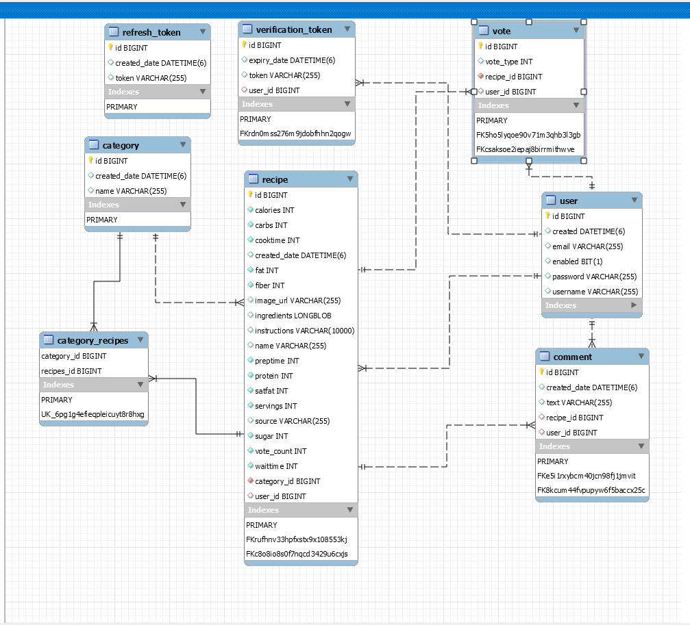

# Recipes Book application

Recipes Book application built using Spring Boot v2.4, Spring Security with JPA Authentication, Spring Data JPA with MySQL - You can find the backend source code here : https://github.com/OuniAbir/recipe-book-back-spring

The frontend is built using Angular v11, bootstrap - You can find the backend source code here : https://github.com/OuniAbir/recipes-book-front-angular

## DataBase Diagram

